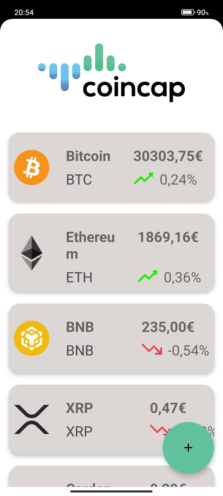
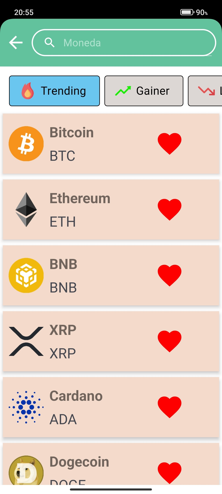

# CryptoList

## About

This project was part of the initial step when joining [Rudo Apps*](https://rudo.es/) company. The main purpose was to assess the initial skills of the new programmers in Android's department (aka 'Academy' in Rudo's jargon). 
Android mentors wanted to know whether internship students knew about how to connect to an API using, for example, **'Retrofit'** library. They also asked us if we were able to display the retrieved cryptocurrency data in sort of a list, preferably using **'RecyclerView'**. We had 1 week to develop and present our solution to our fellows.

## Features
- Connect to an API using **'Retrofit'** library.
- Display retrieved cryptocurrencies data using **'RecyclerView'**.

Some extra features and functionalities, despite not being fully implemented here, were desirable (e.g. being capable of adding to and removing coins from favorites, using some design architecture like MVVM, etc.).

## Contributing
We welcome contributions to this project! Please follow these guidelines when contributing:
- Fork the repository.
- Create a new branch for your changes, make your changes and commit.
- Submit a pull request to the original repository.

## Screenshots
|  |  |
|:------------------------------------:|:-----------------------------:|
| Home Screen                           | Search Screen                   |

## Credits
CoinCap logo in Main Fragment (Home screen) is present there only for design purposes and to attribute API's author (cryptocurrencies data is being fetched from their official website [CoinCap.io]( https://coincap.io/)).

Image header of this README file (the picture of agrupped cryptocurrencies symbols) is created by [kosonicon](https://www.flaticon.com/free-icons/cryptocurrency).
> Also, thanks to the Android mentors at [Rudo Apps*](https://es.linkedin.com/company/rudo) for their guidance and support during this project.

