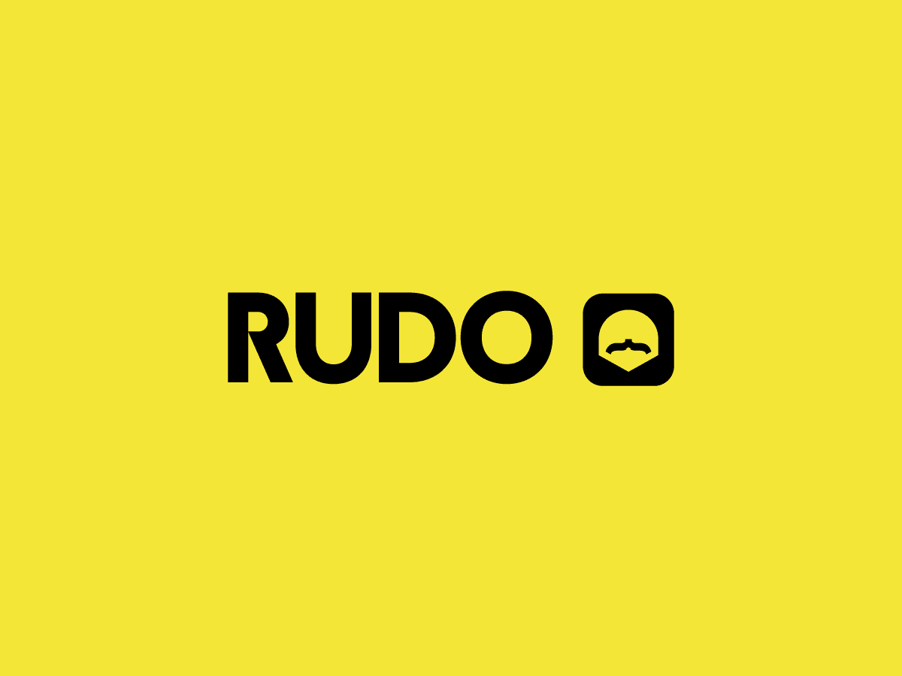

# CryptoList
---

## About

This project was part of the initial step when joining [Rudo Apps*](https://rudo.es/) company. The main purpose was to assess the initial skills of the new programmers in Android's department (aka Academy in Rudo's jargon). 

Android mentors wanted to know whether internship students know about connecting to an API using, for example, Retrofit library. They also asked us if we were able to display the retrieved cryptocurrency data in sort of a list, preferably using RecyclerView.

## Features
- Connect to an API using **'Retrofit'** library.
- Display retrieved cryptocurrencies data using **'RecyclerView'**.

Some extra features and functionalities, despite not being fully implemented here, were desirable (i.e. being capable of favoriting and deleting coins, using some design architecture like MVVM, etc.)

## Contributing
We welcome contributions to this project! Please follow these guidelines when contributing:
- Fork the repository
- Create a new branch for your changes
- Make your changes and commit them with descriptive commit messages
- Submit a pull request to the original repository

## Credits
CoinCap logo in Main Fragment (Home screen) is present there only for design purposes and to attribute API authors where data is being fetched
> Also, thanks to the Android mentors at Rudo Apps for their guidance and support during this project.

## Screenshots and video
Pending

